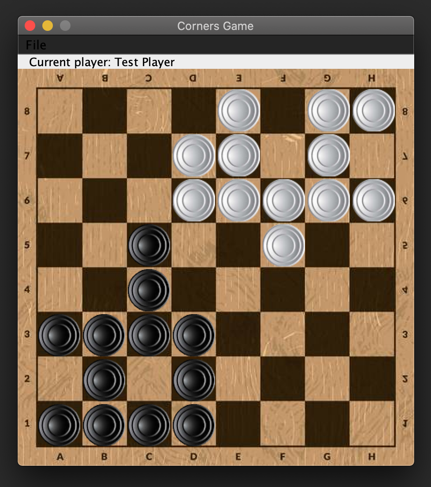

# corners-game

The game is played on a chess board with checkers pieces. Two players start a new game in diagonal corners, like this:

     - - - - x x x x
     - - - - x x x x
     - - - - x x x x
     - - - - - - - -
     - - - - - - - -
     o o o o - - - -
     o o o o - - - -
     o o o o - - - -

A player can move a piece in one of four directions...

     - - - - x x x x
     - - - - x x x x
     - - - - x x x x
     - - - - - - - -
     - - - o - - - -
     o o o - - - - -
     o o o o - - - -
     o o o o - - - -

...or can jump over neighbour pieces as long as he wants.

     - - - - x x x x            - - - - x x x x
     - - - - x x x x            - - - P x x x x
     - - - x - x x x            - - - x - x x x
     - - - - - - - -     --\    - - - - - - - -
     - - - o - - - -     --/    - - - o - - - -
     o P o - - - - -            o - o - - - - -
     o o o o - - - -            o o o o - - - -
     o o o o - - - -            o o o o - - - -

The player who moves all his pieces to the start point of his enemy wins.

# contributors

[@ironsigma](https://github.com/ironsigma)